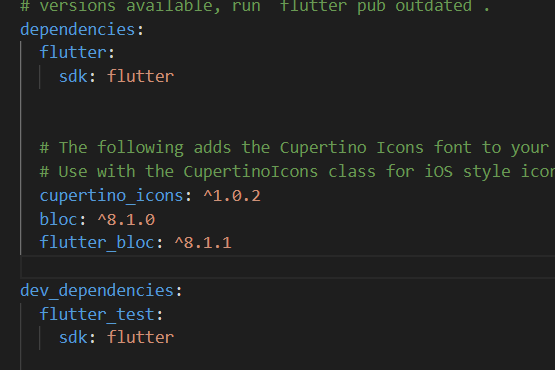
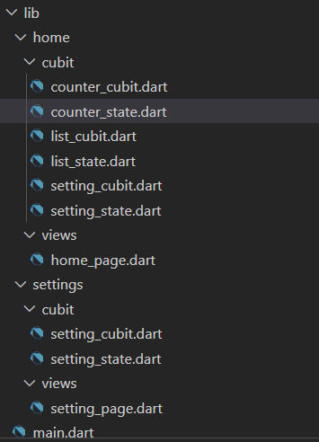
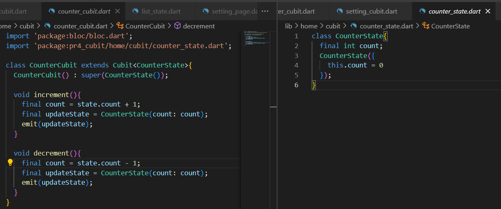
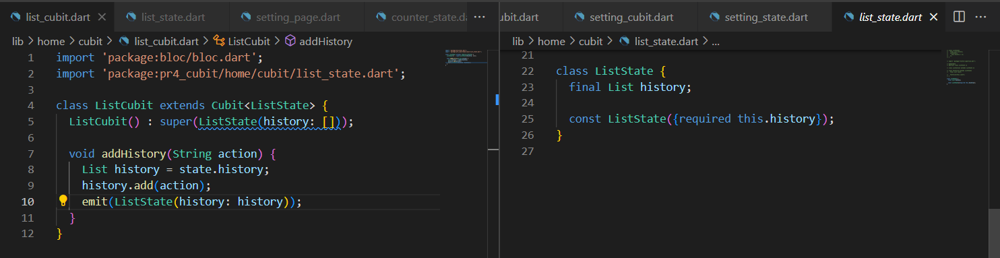
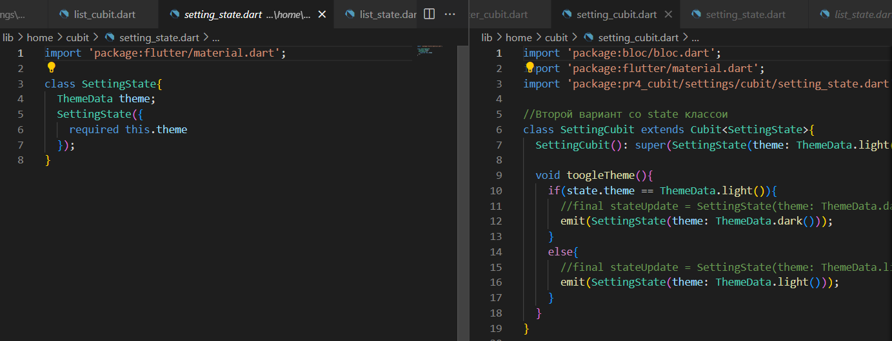
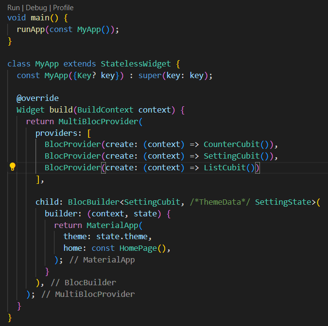
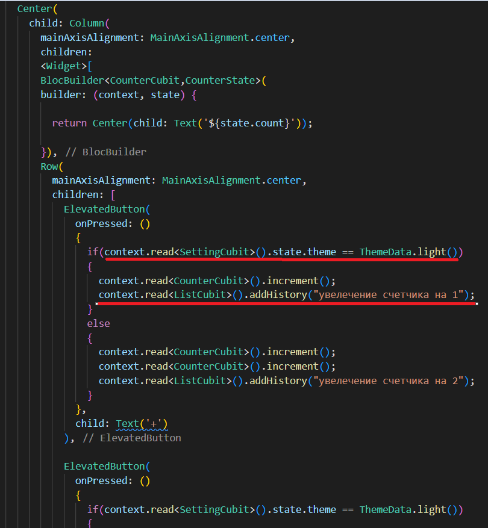
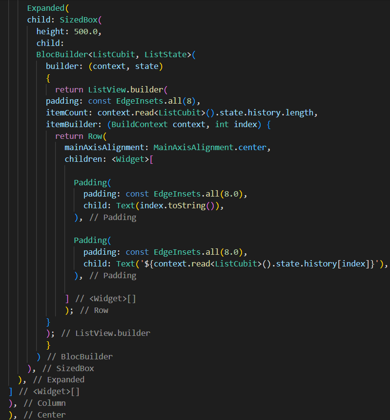
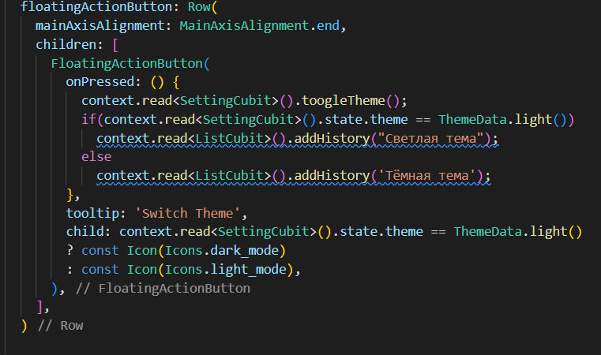
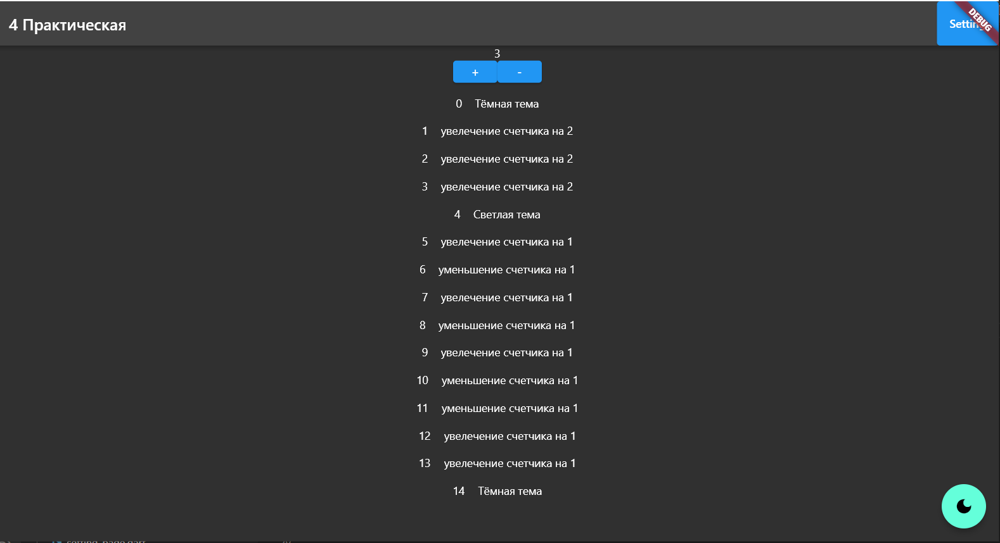

## Cubit

Цель работы: реализовать через cubit счетчик при нажатии на кнопку + осуществляет увеличение счетчика, при нажатии на кнопку - осуществляться уменьшение счетчика. Если текущая тема устройства светлая то за одно нажатие должно +1 или -1. Если текущая тема устройства темная то за одно нажатие должно +2 или -2. Каждое действие должно записываться в историю. История должна быть реализована через виджет ListView.
Ход работы:
Библиотека Cubit предназначена для управления состоянием экрана и позволяет реализовать шаблон проектирования BLoC. С ее помощью можно упростить отделение презентации от бизнес-логики, тестирование и переиспользование кода.
Другими словами, Cubit позволяет обновлять отдельные элементы верстки.
Подключение зависимости:
 

  

Архитектура программы строится следующим образом: папка с названием реализовываемой страницы. Внутри две папки: папка cubit с файлами состояния и логики и папка views с файлом верстки.

  

Реализация Cubit идет по средствам файла состояния и файла логики.
Файл состояния хранит в себе переменную, которая в ходе исполнения логики будет обновляться. Файл логики производит изменяет переменную состояния.
Реализация cubit для счетчика, темы и элементов List View:

  

 

  

  

При помощи функции emit происходит изменение состояния.
MultiBlocProvider позволяет объединить несколько cubit для передачи их context на отображаемую страницу.
В случае смены темы приложения помимо MultiBlocProvider на отображаемую страницу накладывается BlocBuilder с состоянием и логикой cubit темы приложения. Благодаря BlocBuilder происходит перерисовка всех элементов верстки.
 

  

Именно благодаря context MultiBlocProvider можно получить как нынешнее состояние переменной из состояния cubit, так и вызвать логику нужного cubit.

 

  

Для отображения историй использовался динамический ListView. ListView.builder() в качестве параметра itemBuilder принимает объект IndexedWidgetBuilder, который создает элементы списка.
Объект IndexedWidgetBuilder, который передается параметру itemBuilder, по сути представляет функцию Widget Function(BuildContext context, int index), которая получает контекст виджета, а также индекс и возвращает созданный виджет.
ListView также устанавливается количество элементов с помощью параметра itemCount - оно равно количеству объектов в списке users: itemCount: users.length (в данном случае 5 элементов). В итоге itemBuilder будет последовательно перебирать числа от 0 до users.length, которые передаются в параметр index, и таким образом для каждого передаваемого индекса создавать виджет Text и передавать в виджет значение users[index].
Очень важно обернуть ListView в BlocBuilder для его перерисовки. Иначе ListView просто не будет отображаться.

  

  

  

Вывод: удалось научиться использовать Cubit и реализовать счетчик, смену темы и запись истории на основе Cubit.

